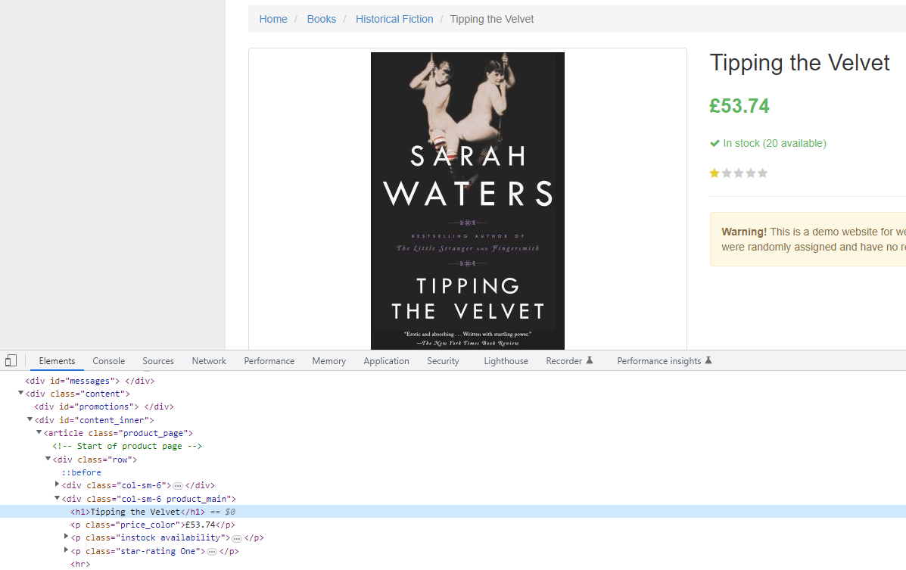
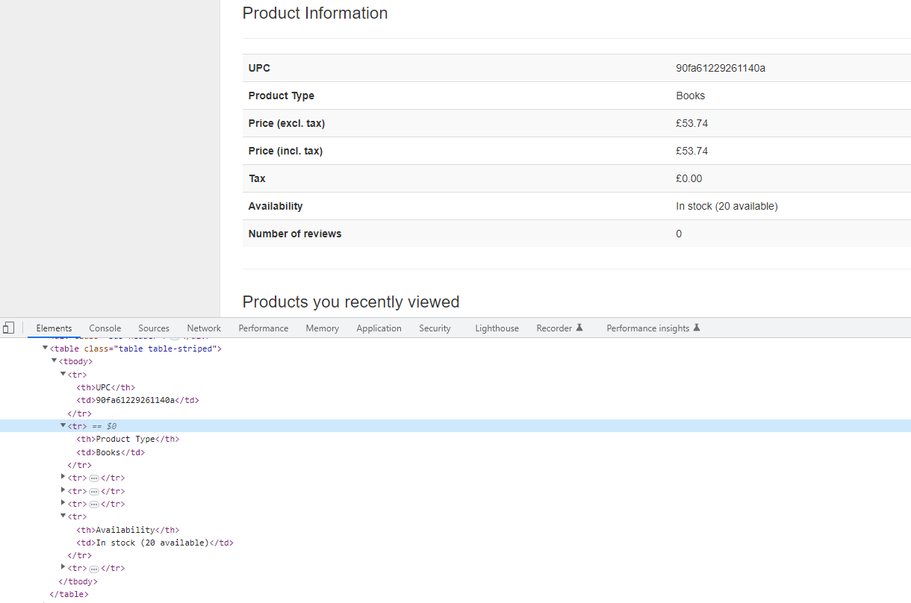

Continuing from previous tutorial I will add pagination into the scrapy spider to get the books data from different page and follow next page links to get all the books on webpage.

---

# Introduction

I will continue improving the web scraper I started in previous tutorial by adding pagination, getting the book data from  books page and storing the data into scrapy Items.

## Getting book information
In previous tutorial we got the link to the page containing book information and now be will make the spider go to the link and get the data from there. 

example link: http://books.toscrape.com/catalogue/tipping-the-velvet_999/index.html

The data we will get from the page is book title, price, upc, product type and availability. 

### Book title and price


The book title is inside `<div class="col-sm-6 product_main">` and the price is just below that inside a `<p class="price_color">£53.74</p>`.

Using the scrapy shell it is easy to navigate and get the correct data.
```bash
$ scrapy shell http://books.toscrape.com/catalogue/tipping-the-velvet_999/index.html

>>> product_main = response.css("div.col-sm-6.product_main")
>>> title = product_main.css("h1::text").get()
>>> price = product_main.css("p.price_color::text").get()
```

Now we have the title and price from page nd next will be to get the data from product information table.

### Books product information table


There is many ways to scrape data from a table and today I will use the simplest way to do it. Getting the `td` values in a list and picking the correct values using the correct index value.

Using scrapy shell to get the data
```bash
>>> product_information = response.css("table.table.table-striped")
>>> table_data = product_information.css("td::text").getall()
>>> ups = table_data[0]
>>> product_type = table_data[1]
>>> in_stock = table_data[5]
```

That is everything we needed from the that page. Next is the get the link to the next page and putting the all the code into the spider.

## Grabbing next page link
Checking the next page button and the following html code for it.
```html
<li class="next"><a href="catalogue/page-2.html">next</a></li>
```

You can use the scrapy shell to test getting the url to the next page
```bash
scrapy shell http://books.toscrape.com/
>>> response.css("li.next a").attrib['href']

'catalogue/page-2.html'

```

## Putting the code into the books_spider.py

There is four parts into this code.
1. Starts the spider and goes to the main page with 20 book titles.
2. Get all links to the books.
3. Loop the links for the books and make the spider scrape the data from the url.
4. Get the next page link and if found go to next page.


```python 
import scrapy

from books.items import BooksItem

class BooksSpiderSpider(scrapy.Spider):
    name = "books_spider"
    allowed_domains = ["books.toscrape.com"]
    start_urls = ["http://books.toscrape.com/"]
    
    def parse(self, response):  
    books = response.css("article.product_pod")
    
    # loop all books and goto the book page to scrape the data
    for book in books:
        full_url = response.urljoin(book.css("h3 a").attrib['href'])
        yield scrapy.Request(full_url, callback=self.parse_book)
    # after all books on page are searched. Get the next page link
    next_page_url = response.css("li.next a").attrib['href']
    
    if next_page_url is not None:
        # Follow the next page link and call the parse method again
        yield response.follow(next_page_url, callback=self.parse)
    
    def parse_book(self, response):
        """ Parses the book data and saves into an item which is then yielded"""
        
        item = BooksItem()
        product_main = response.css("div.col-sm-6.product_main")
        item['title'] = product_main.css("h1::text").get()
        item['price'] = product_main.css("p.price_color::text").get()
        product_info = response.css("table.table.table-striped") # Contains the html table with product information
        item['upc'] = product_info.css("td::text").get()
        item['product_type'] = product_info.css("td::text")[1].get()
        parse_numbers = "".join(x for x in product_info.css("td::text")[5].get() if x.isdigit())
        item['in_stock'] = int(parse_numbers)
        
        yield item
```

In `parse_book()` method I am using `BooksItem()` class to store the data. Imported from items.py file.

## items.py
```python
import scrapy

class BooksItem(scrapy.Item):
    # define the fields for your item here like:
    # name = scrapy.Field()
    
    title = scrapy.Field()
    price = scrapy.Field()
    upc = scrapy.Field()
    product_type = scrapy.Field()
    in_stock = scrapy.Field()
```

 # What are Items?
 - A container to collect the scraped data. Functions the same way as python dictionaries, but with added benefits.
 -  To read more about using scrapy Items [scrapy documentation](https://docs.scrapy.org/en/latest/topics/items.html)

 # Why use them?
 - In bigger web scraping projects it better to use Items to keep track of the data.
 - It is possible to put the data parsing and cleaning into the Item class. Which helps to validate the data that is scraped and avoid errors that could happen.

# Summary
In this tutorial I showed how to make the scrapy spider request links and parse the data on page, follow to the next page and repeat the process until all pages are done.
