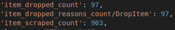
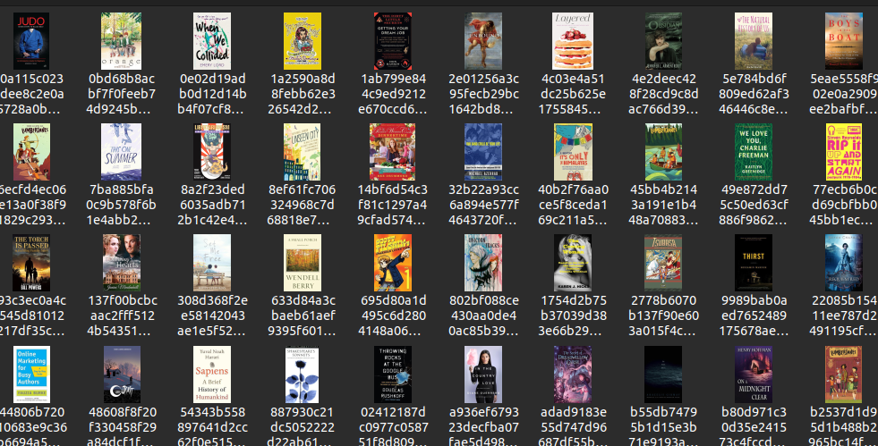

# Introduction
In this tutorial I will show how to use the Scrapy item pipeline to parse, clean, validate, checking for duplicates and storing in a database and downloading images from the webpage.
Scrapy documentation about [item pipeline](https://docs.scrapy.org/en/latest/topics/item-pipeline.html).

# What is item pipeline?
When the spider scrapes an item it is sent to the Item Pipeline which will then process it. Item pipeline is a python class that must implement the *process_item* method. The pipeline can also implement optional `open_spider` and `close_spider` methods. 
- `open_spider` method is run when the spider starts.
- `close_spider` method is run when the spider is closing down.
## Enabling the pipelines
In `settings.py` uncomment the following line to enable the pipeline.

```
ITEM_PIPELINES = {
   "books.pipelines.BooksPipeline": 300,
}

```
## Cleaning the data
Using the `ItemAdapter` to get the item values and then validating or parsing the data.

`pipelines.py`
```python
from itemadapter import ItemAdapter
 
class BooksPipeline:
    def process_item(self, item, spider):
    adapter = ItemAdapter(item)
    # Removing the £ symbol from price
    if adapter.get('price'):
        adapter['price'] = adapter['price'].replace("£", "")
    return item

```
## Dropping duplicates
- While scraping items there can be duplicates that were already processed. To avoid processing same data multiple times there is an simple way to check if the data is already processes and drop the item with `DropItem`.    

Here is a simple example of checking for duplicate prices and dropping the item.  

`pipelines.py`  

```python
from itemadapter import ItemAdapter
from scrapy.exceptions import DropItem

class BooksPipeline:
    def __init__(self):
        self.price_seen = set()
    
    def process_item(self, item, spider):
        # Check if the price in item is already seen and drop the item if true
        adapter = ItemAdapter(item)
        if adapter['price'] in self.price_seen:
            raise DropItem(f"Duplicate price found. Dropping the item: {item}")
        else:
            self.price_seen.add(adapter['price'])
            return item
```


## Storing in database
- I am using sqlite database for this tutorial but you can use mysqli, mongodb or something else.
- This code creates a *books.sqlite* database file with a table for books data when initializing the `BooksPipeline` class.
- `process_item` adds the item data into the table if possible.  

`pipelines.py`
```python
from itemadapter import ItemAdapter
import sqlite3

class BooksPipeline:
    def __init__(self):
        self.con = sqlite3.connect("books.sqlite")
        self.cur = self.con.cursor()
        self.create_table()
        
        def create_table(self):
        # Create table if it does not exists
        self.cur.execute("""CREATE TABLE IF NOT EXISTS books(title TEXT,price REAL, upc TEXT, product_type TEXT, in_stock INTEGER) """)
    
    def process_item(self, item, spider):
        self.cur.execute(""" INSERT OR IGNORE INTO books VALUES (?,?,?,?,?) """, (item['title'], item['price'].replace("£",""), item['upc'], item['product_type'], item['in_stock']))
        self.con.commit()
        return item
```

## Viewing the data from database
Easy way to view the data from sqlite file is to use `sqlitebrowser`.  
`$ sudo apt install sqlitebrowser`


# Images pipeline
- The Images Pipeline requires [Pillow](https://github.com/python-pillow/Pillow) 7.1.0 or greater.  
`$ pip install pillow`
- Scrapy documentation [media pipeline](https://docs.scrapy.org/en/latest/topics/media-pipeline.html)
- Default `Items` field name used to store the image urls is `image_urls`. 
## Enabling media pipeline
In `settings.py`  
`ITEM_PIPELINES = {"scrapy.pipelines.images.ImagesPipeline": 1}`  
and configurating the storage location by adding  
`IMAGES_STORE = "/path/to/valid/dir"`  

If the path is not valid the pipeline will remain disabled.

If everything is correct the images will be saved into the directory given in `IMAGES_STORE`.  

- Default setting to storing the file is using SHA1 hash of the URLs.  


```python
import scrapy
from books.items import BooksItem
  
class BooksSpiderSpider(scrapy.Spider):
    name = "books_spider"
    allowed_domains = ["books.toscrape.com"]
    start_urls = ["http://books.toscrape.com/"]
    
    
    def parse(self, response):
        books = response.css("article.product_pod")
        # loop all books and goto the book page to scrape the data
        for book in books:
            full_url = response.urljoin(book.css("h3 a").attrib['href'])
            yield scrapy.Request(full_url, callback=self.parse_book)
            # after all books on page are searched. Get the next page link
            next_page_url = response.css("li.next a").attrib['href']
        
        if next_page_url is not None:
            yield response.follow(next_page_url, callback=self.parse)
    
    def parse_book(self, response):
        item = BooksItem()
        product_main = response.css("div.col-sm-6.product_main")
        product_info = response.css("table.table.table-striped") # Contains the html table with product information
        item['title'] = product_main.css("h1::text").get()
        item['price'] = product_main.css("p.price_color::text").get()
        item['upc'] = product_info.css("td::text").get()
        item['product_type'] = product_info.css("td::text")[1].get()
        parse_numbers = "".join(x for x in product_info.css("td::text")[5].get() if x.isdigit())
        item['in_stock'] = int(parse_numbers)
        image_link_relative = response.css("img").attrib['src']
        # convert the relative image link into absolute
        item['image_urls'] = [response.urljoin(image_link_relative)]
        
        yield item
```

# Summary
In this tutorial I showed what the Item-Pipeline does and how to use it to parse, validate, remove duplicates and store data. And also showed how to use media-pipeline to download images from the website.


---
