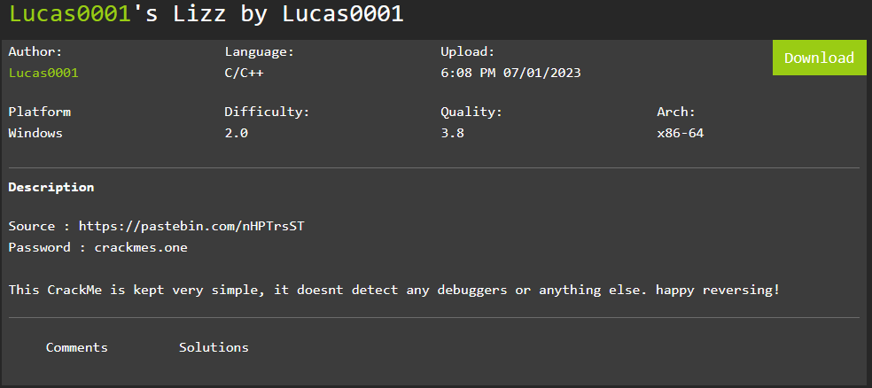
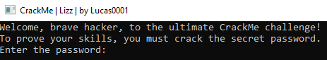
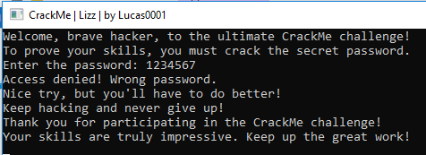
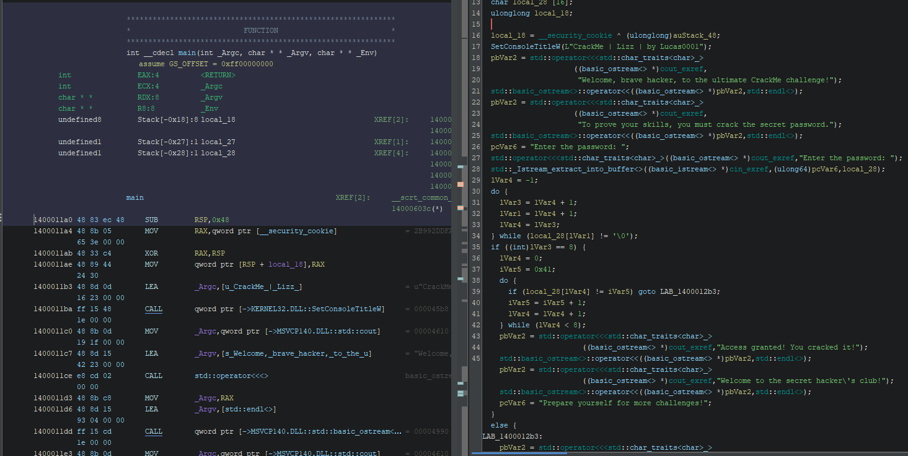
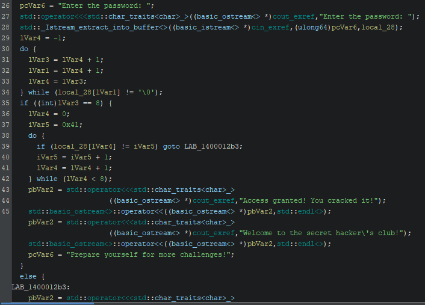
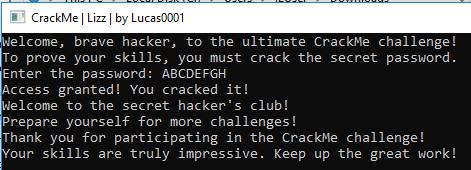

Here is my writeup of Lucas0001's Lizz by Lucas0001  
https://crackmes.one/crackme/64a06bac33c5d460c17f1f59

# Description
Here is the description of the crackme. Looks to be pretty straight forward.

# Running the program
Running the program opens a CLI program that asks for password.

## Wrong password message
Entering wrong password gives a message about not giving up.

## Opening the program in Ghidra and locating the main function
Looking at the main function everything looks pretty readable. The strings from the program are easily visible and no weird jumps/calls in sight.

## Analyzing how the password checking works

Password is stored on line 28 into a *local_28* variable and after that comes a do while loop (lines 30-34) that loops the password string while saving the length into *lVar3*. 

After the loop *lVar3* is checked if it equals to 8 (line 35) and if true then goes to a second loop.

Line 39 password\[*iVar4]* is checked with *iVar5*, which is set above on line 37 to 0x41 ('A' in ascii) else jumps to the wrong password message. Then the loop increases the counter *iVar4*  and *iVar5* by one and continues until the loop is done eight times.

This means the password must be eight characters long and start with capital 'A' followed by next seven letters. 

So correct password is "ABCDEFGH".

# Conclusion
I looked for a crackme with low difficulty for first crackme writeup and found this crackme which was an easy challenge and the other reason for choosing this is because I got it to run without problems :)  
If you are just starting with reverse engineering and using the disassemblers, this is a good crackme to try.
