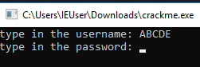
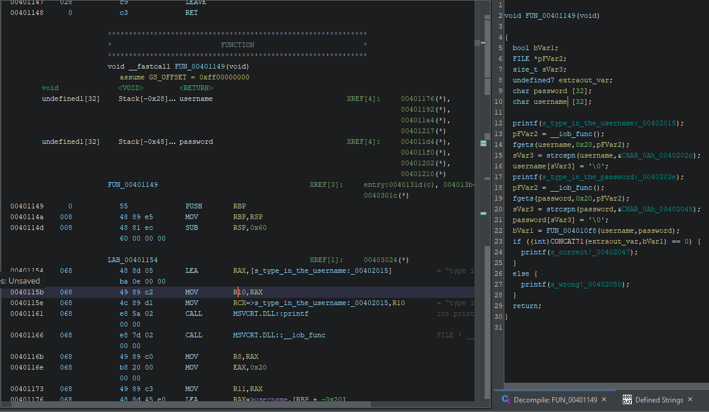
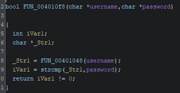
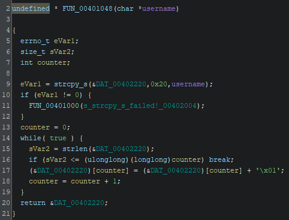
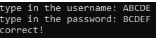
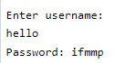

This is a writeup explaining how I solved the crackme.

---

Here is my writeup of [Zun1's zun1 crackme](https://crackmes.one/crackme/652c30d56e7e520ff1c3da60)


# Description
The description is short and simple.
> patching is easy, write a keygen

# Running the program
Running the program opens a CLI program that asks for password.


## Wrong password message
Entering wrong password gives a message "wrong" and exits the program right away.


## Opening the program in Ghidra
  

Main function **FUN_00401149**

fgets is used to get the username and password inputs and then they are passed into function FUN_004010f8. The return value is used to check if the password is correct or not.

### FUN_004010f8
  
Username is passed to another function (FUN_00401048) and the return value from it is used to compare with the password, which gets then returned to main function. Meaning something gets done to username and password is not manipulated in any way.

### Looking into FUN_00401048
  
In here the username gets copied into DAT_0040220 and then start a while loop.
sVar2 gets the length of the DAT_0040220 and if the length is less than or equal to counter then breaks out of the while loop. Otherwise the character at DAT_0040220\[counter] gets increased by 1. Meaning A->B, B->C etc. And the counter gets increased at the end of the loop for next round.

In conclusion this function saves the username into DAT_0040220 and then the loop goes through the username and increases all characters by one character. Lastly returns address of DAT_0040220 containing the newly created string.

Back to FUN_004010f8 the password is compared with the new string created from username in previous function and the result is returned to the main function. If the password is equal to the string created from username then the good message is show.

  

The program exits right away after taking the password value, so I am using a debugger to break the program after printing the message.

# Keygen
Creating a keygen is simple. Take the username, loop the username characters and add 1 to the each character.

```python
def main():
    username = input("Enter username: ")
    password = ""
    
    for c in username:
        password += chr(ord(c)+1)
    
    print(f"Password: {password}")
    
if __name__ == "__main__":
    main()
```

